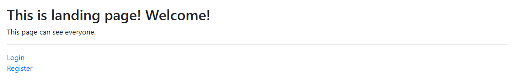
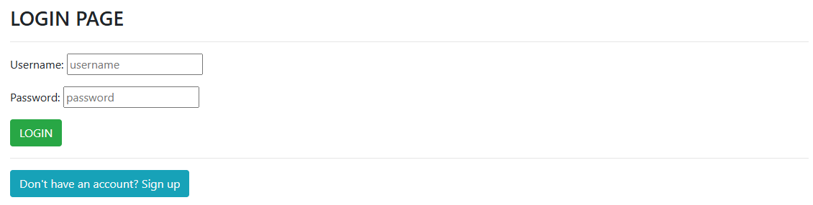
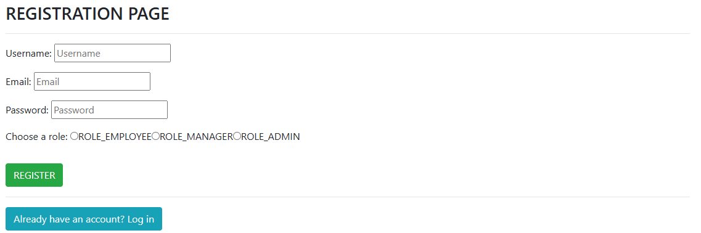
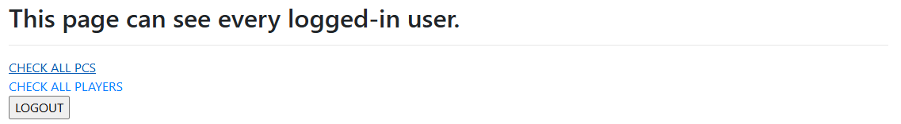
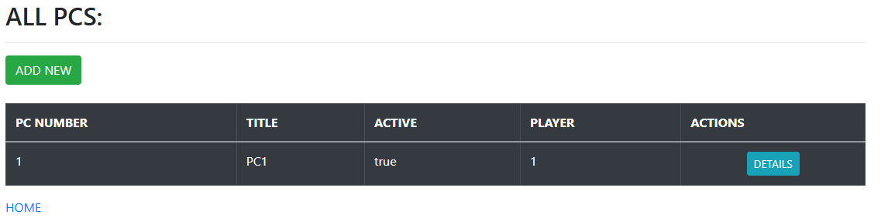
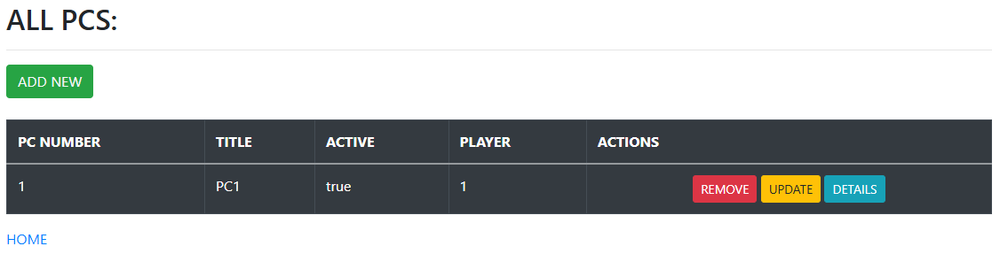

<h1 align = "center">
<i>"Game Room"</i> Project 
</h1>

Spring Boot MVC web application with Spring Boot Security. 
Manage PCs and Players.

This project is not made to look good visually, but to be functional.

# Content:

- [Project](#project)
- [Project Description](#project-description)
- [ER Diagrams](#er-diagrams)
  - [Login/Registration](#loginregistration)
- [Endpoints](#endpoints)
  - [Demo Controller](#democontroller)
  - [Pc Controller](#pccontroller)
  - [Player Controller](#playercontroller)
  - [Login/Registration Controller](#loginregistrationcontroller)
- [To Do](#to-do)

# Project

- Spring Boot Version:
- Java Version:
- Dependencies:
  - Spring Boot JPA,
  - MySQL Driver,
  - Spring Web,
  - Thymeleaf,
  - Spring Security
- Bootstrap

 

IMAGES

- Landing page:

  
  

- Login page:

  
  

- Registration page:

  
  

- Home page:

  
  

- Employee PC View (_Same with Employee Player View_):

  
  

- Manager PC View (_Same with Manager Player View_):

  
  

- Admin PC View (_Same with Admin Player View_):

  
  

# Project Description

The "Game Room" project is designed to monitor the availability of each PC, its details and current player.
Provided tables present a list of available PCs, their Details and the Players currently using them.
Player can't be stored into database/table if he's not using the PC.

# ER Diagrams

| Relationship     | Association    | Fetch Type | Description                                                                                                                            |
|------------------|----------------|------------|----------------------------------------------------------------------------------------------------------------------------------------|
| pcs - pc_details | Bi-directional | LAZY       | If pc deleted also delete his pc details. If pc details deleted, don't delete pc.  If we save pc, also save his details if linked. |
| pcs - players    | Bi-directional | LAZY       | If player deleted, don't delete pc. If pc deleted also delete player.  If we save player, don't save pc.                           |

## Login/Registration

# Endpoints

## DemoController

| Request | Link                    | Description                                          |
|---------|-------------------------|------------------------------------------------------|
| GET     | localhost:8080          | Landing page. Everyone can see this page.        |
| GET     | localhost:8080/home     | Home page. Only logged users can see this page.  |
| GET     | localhost:8080/account  | Your account page. _(username, password, role, ...)_ |

## PcController

| Request      | Link                                      | Description                                                                                                      |
|--------------|-------------------------------------------|------------------------------------------------------------------------------------------------------------------|
| GET          | localhost:8080/pcs                        | Show all pcs. Every logged user can see.                                                                     |
| GET          | localhost:8080/pcs/{pcNumber}             | Show Details about pc.  Every logged user can see.                                                           |
| GET (DELETE) | localhost:8080/remove/pc/{pcNumber}       | Delete pc.  Only Admins can delete pc.  Reason why delete with GET: html form can't send DELETE request. |
| DELETE       | localhost:8080/remove/pc/{pcNumber}       | Delete pc.  Only Admins can send delete request.                                                             |
| GET          | localhost:8080/save/pc                    | Show form for ADDING a new pc.   Only Managers & Admins can see.                                             |
| POST         | localhost:8080/save/pc                    | Save pc.   Only Managers & Admins can save pc.                                                               |
| GET          | localhost:8080/update/pc/{pcNumber}       | Show form for UPDATING the pc. Only Managers & Admins can see.                                               |
| PUT          | localhost:8080/update/pc/{pcNumber}       | Update pc. Only Managers & Admins can update pc.                                                             |
| POST         | localhost:8080/form/update/pc/{pcNumber}  | Update pc.  Only Mangers & Admins can update pc.  Same reason with DELETE request.                       |

## PlayerController

| Request      | Link                                         | Description                                                                                                              |
|--------------|----------------------------------------------|--------------------------------------------------------------------------------------------------------------------------|
| GET          | localhost:8080/players                       | Show all players. Every logged user can see.                                                                         |
| GET          | localhost:8080/players/{playerId}            | Show Details about player.  Every logged user can see.                                                               |
| GET (DELETE) | localhost:8080/remove/player/{playerId}      | Delete player.  Only Admins can delete player.  Reason why delete with GET: html form can't send DELETE request. |
| DELETE       | localhost:8080/remove/player/{playerId}      | Delete player.  Only Admins can send delete request.                                                                 |
| GET          | localhost:8080/save/player                   | Show form for ADDING a new player.   Only Managers & Admins can see.                                                 |
| POST         | localhost:8080/save/player                   | Save player.   Only Managers & Admins can save new player.                                                           |
| GET          | localhost:8080/update/player/{playerId}      | Show form for UPDATING the player. Only Managers & Admins can see.                                                   |
| PUT          | localhost:8080/update/player/{playerId}      | Update player. Only Managers & Admins can update player.                                                             |
| POST         | localhost:8080/form/update/player/{playerId} | Update player.  Only Mangers & Admins can update player.  Same reason with DELETE request.                       |

## LoginRegistrationController

| Request | Link                            | Description         |
|---------|---------------------------------|---------------------|
| GET     | localhost:8080/showLoginPage    | Login page.         |
| GET     | localhost:8080/showRegisterPage | Registration page.  |
| GET     | localhost:8080/access-denied    | Access Denied page. |
| POST    | localhost:8080/logout           | User logout.        |
| POST    | localhost:8080/register         | Add/Save new user.  |

# TO DO

JWT, Spring Email, Pagination, 