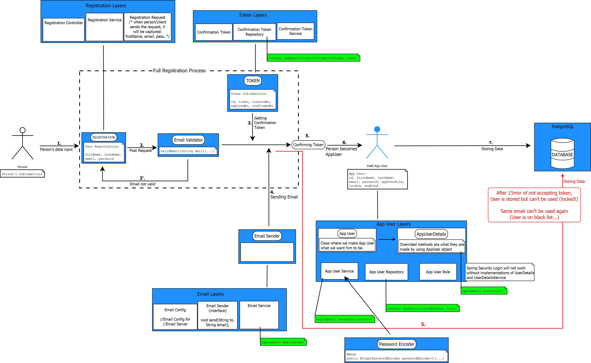

# Login, Registration, Spring Security, Email Verification

<p align="center">
  
</p>
<hr/>

<h2>Contents: </h2>

- [Login, Registration, Spring Security, Email Verification](#login-registration-spring-security-email-verification)
  - [Intro](#intro)
  - [User registration](#user-registration)
  - [Registration process](#registration-process)
  - [Application user (roles: admin,user)](#application-user-roles-adminuser)
  - [Secure endpoints (spring security)](#secure-endpoints-spring-security)

Registration and User Login + Email Verification (Token Expires) + Encrypted Password

## Intro

Person wants to become user of our system, and after they complete a <i>user registration, verification links, email</i>
they become user with a <i>user role</i> in application. Person becomes user when the registration was successful. After registration goes login.

Once Person becomes Application User, they can before defined actions.

## User registration

<p align="center">
  POST HTTP Request from Person:
  <br/>
    
</p>

<p align="center">
    Email that has been send:
    <br/>
    
</p>

Verification link will expire in 15min.

Confirming Token from PostMan in order to become App User, (GET Request):
<pre>localhost:8080/api/game/registration/confirm?token=4df3538f-fc3c-4b7f-a121-1991d7d603d5</pre>

## Registration process



## Application user (roles: admin,user)

User should be able to only see available PCs, but Admin can do all.

## Secure endpoints (spring security)

All available endpoints are secured by spring security.

<hr/>

Clone full project: 
```bash
git clone https://github.com/fajni/Game_Room.git
```

_Note: In full project AppUserDetails class in removed. AppUser implements UserDetails_